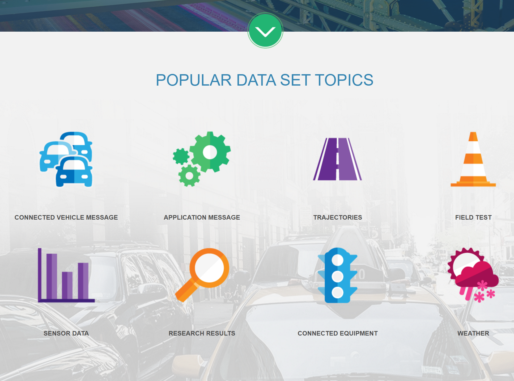
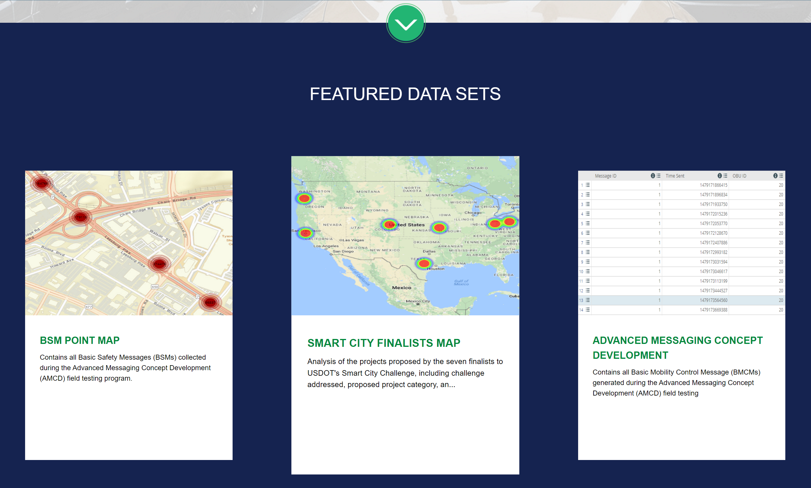

# USDOT JPO Microsite Template

The microsite is a standalone website that has been templated so that small changes can be made in a couple json files to create the desired website look and functionality.  

The microsite template is designed to provide users of USDOT data a new standardized entry point for them to explore USDOT DOT data and for various groups within the USDOT to create customize data home pages with the template to promote their data.  The template is not intended to be a replacement for data.transportation.gov (DTG) or the National Transportation Library (NTL) sites but instead enhance those sites by providing additional entry points to those two systems in support of the ITS JPO No Wrong Door Policy. 

The website capabilities include querying desired data from a given domain, creating custom categories/buttons that search through the given domain, and displaying featured datasets for users to see on page load.

The microsite template is layed out with three different sections to allow users and site manager different ways to access and promote the data.  The three sections are:

- **General search box** – Text based search box to allow users to search for any term they want.  This box searches DTG and NTL for the term the user enters for the site. For example, if a user enters “weather” into the search box of the ITS JPO microsite the site will return all dataset results that have been tagged with the term “weather” somewhere in the datasets tags, title or description.

- **Data Set Topics** – This section provides the user with a set of topics they can select from.  Once the user selects a topic the site pulls data based on the one or more tags corresponding  to that category topic. So, if a user selected the topic like Smart City and the input files had the tags "connected vechicle" and 'smart city' linked to that topic than the results that would be returned are data sets with those two tags

- **Featured Data Set** – This section lists a series of three data sets that site manager wants to highlight.  Users clicking on one of these datasets would be taken directly to that given dataset


## Getting Started

The microsite is a template where the main files to alter is template_categories.json and template_datasets.json.

### template_categories.json:
This file contains all the category data and extra data such as domain for searching some background images and search bar placeholder text.  Below is a cut out of what the microsite looks like and the json associated with the screenshot.


Header Layout in JSON Format:
These three fields are what controls the header.  
1. "domain" is what will be searched for datasets.
2. "background_image" is a chosen background image placed in "/images" will appear behind the search bar.  
3. "Search Text" is what appears as a placeholder in the search bar.
4. "contact_email": is the email that will be displayed in the footer of the page.

```
{
    "domain" : "data.transportation.gov",
    "background_image": "./images/Transportation Background.png",
    "search_text": "",
	"contact_email": "data.itsjpo@dot.gov",
```

Category Layout in JSON Format:
Place the all image files for categories in the "/images/icons" for organization and reference them in the "imgIcons" field
The tags field indicates what other search terms will also be searched along with the category name when the category is chosen/clicked.  If no tags are written in the array then the search will simply search for the category name.

```
"buttons": [
    {
            "CategoryName": "Connected Vehicle Message",
            "imgIcons": "images/icons/CVPCars.png",
			"rolloverImages": "images/icons/CVPCars_Rollover.png",
            "altText": "car icon",
			"tags": []
        }, {
            "CategoryName": "Application Message",
            "imgIcons": "images/icons/AppMessage.png",
			"rolloverImages": "images/icons/AppMessage_Rollover.png",
            "altText": "car icon",
			"tags": []
        },
		...
```

### template_datasets.json:
This file contains all the dataset data.  Below is a cut out of what the microsite looks like and the json associated with the screenshot.

Dataset Layout in JSON Format:
There are five fields for each dataset:
1. This is the name that will be displayed.  If no name is provided the title of the page that is pulled from the URL will be used.
2. This is the description of the dataset that will be displayed.  If no description is provided the description of the page that is pulled from the URL will be used.
3. The URL is where the data will come from.
4. The image is the image that will be displayed.
5. This is the alternate text for accessibility.

```
"datasets": [
    {
		"name": "BSM Point Map",
		"description": "Contains all Basic Safety Messages (BSMs) collected during the Advanced Messaging Concept Development (AMCD) field testing program.",
        "url": "https://data.transportation.gov/Automobiles/BSM-Point-Map/fgbu-uats",
        "image": "./images/BSM.PNG",
        "altText": "Rail road car for rail related injuries"
    },
    {
		"name": "",
		"description": "",
        "url": "https://data.transportation.gov/Research-and-Statistics/Smart-City-Finalists-Map/gtg7-kcxb",
        "image": "./images/SmartCity.PNG",
        "altText": "Map of smart city finalists"
    },
```
### Prerequisites

The microsite is developed completely using JavaScript, CSS, and HTML and requires no installation of software to run.  The site is also designed to use the ITS JPO CSS file but could be changed to meet other USDOT groups website design needs.   JavaScript and CSS libraries are:

* [JavaScript jQuery v3.2.1](http://www.dropwizard.io/1.0.2/docs/) - Used for AJAX calls
* [JavaScript Vue](https://maven.apache.org/) - Framework used for HTML to Javascript data transfer
* [CSS font-awesome v4.7.0](http://fontawesome.io/) - Used to style the microsite
* [CSS bulma v0.5.0](https://bulma.io/) - Used to handle grid layouts

All the libraries are included in the template and don’t need to be downloaded to run the template.

### Installing

1. Clone the repository

2. Open and alter the template_categories.json.

3. Validate the data with json format checker such as jsonformatter or jsonlint to make sure it is a valid json as it will not run without it.

4. Launch it in a local webserver for testing since it is required to load the json file.

### Testing

1. In order to run tests 'npm install' must be run.  The installation requires that node package manager is installed (npm).  This command installs all dependencies specified in the package.json

2. Open up a terminal at '/microsite' and run the command 'http-server'.  This will create an instance of the website to run locally.

3. Navigate into the '/microsite/test' directory and from another terminal run the shell script using ./testRunner.js in the terminal. This script will run the browser tests.

The test cases use a variety of different softwares to run these tests
* [Selenium Webdriver](http://www.seleniumhq.org/projects/webdriver/) - Software used to run the tests in the three web browsers IE, Firefox, and Chrome.
* [Mocha JS](https://mochajs.org/) - Framework used to handle the test cases.
* [Chai JS](http://chaijs.com/) - Assertion library used in conjunction with MochaJS.
* [http-server](https://www.npmjs.com/package/http-server) - HTTP server created to run the website locally


## Versioning

* **Version 1.0** -  Initial version of the template 


## License

This project is licensed under the Apache License - see the [LICENSE.txt](LICENSE.txt) file for details